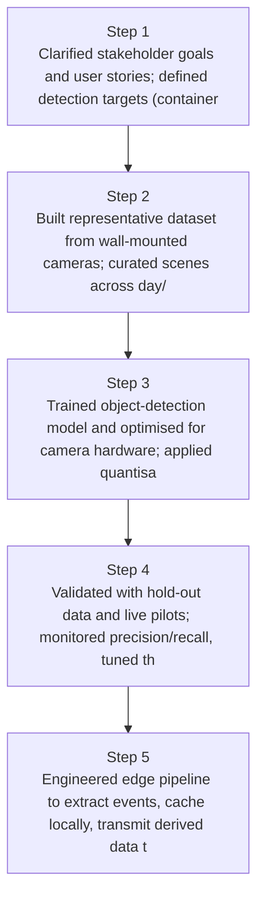
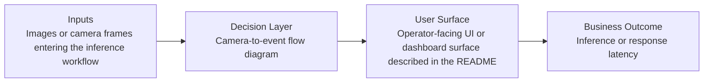
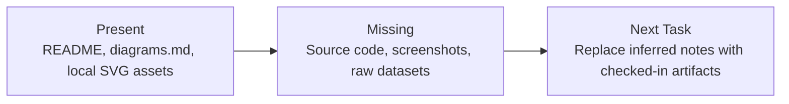

# Edge AI Container & Trailer Detection Diagrams

Generated on 2026-04-26T04:29:37Z from README narrative plus project blueprint requirements.

## Edge detection pipeline

## Camera-to-event flow diagram

## Evidence Gap Map

